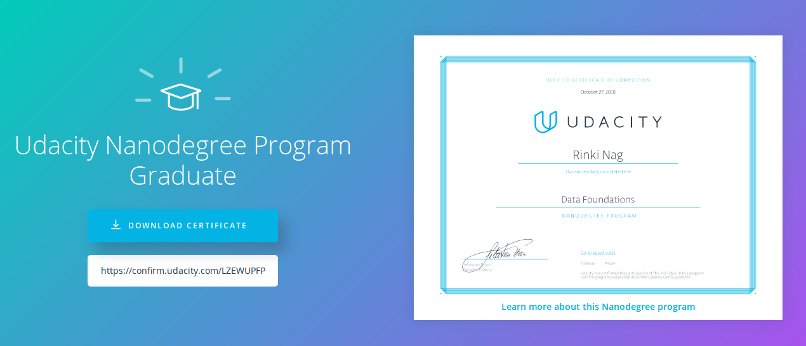

# Data_Foundations_Nanodegree
This repository contains all my projects reviewed by mentors during my Nanodegree and also find my blog article https://allaboutbeingtecky.wordpress.com/2018/11/07/my-experience-in-data-foundations-nanodegree-udacity-bertelsmann/

## Project I - Interpret a Data Visualization
We had to choose any dashboard from following options

* Madrid in Detail
* Malaria in Africa
* LinkedIn Top Skills 

Then find minimum three insights in the visualizations and prepare report from it.

And we have to meet the criteria of Rubric
### Project Rubric
Rubric Link for this project: https://review.udacity.com/#!/rubrics/1063/view

## Project II - Analyze Survey Data
We had to analyze the Excel sheet which contains the survey results conducted by Udacity on the Nanodegree Graduates
We had to derive insights from the data and present it into PPT format 

### Project Rubric
Rubric Link for this project: https://review.udacity.com/#!/rubrics/975/view

## Project III - Music SQL Database
We had to analyze the Chinook Database , Chinook Database holds information about a music store from which we have to write query and derive insights.
We had to derive insights from the data and present it into PPT format 

### Project Rubric
Rubric Link for this project: https://review.udacity.com/#!/rubrics/1061/view

## Project IV - Build Data Dashboards in Tableau
 I created visualizations to reveal insights from a data set. I createD data visualizations that tell a story or highlight patterns in the data set. I worked should be a reflection of the theory and practice of data visualization, such as visual encodings, design principles, and effective communication.

### Project Rubric
Rubric Link for this project: https://review.udacity.com/#!/rubrics/1060/view

